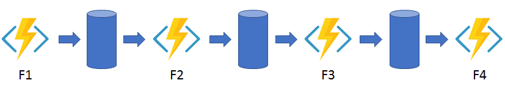
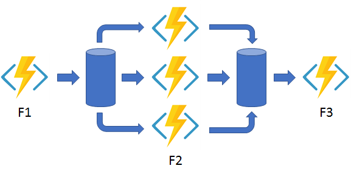
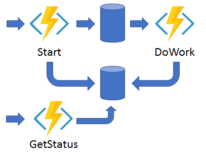
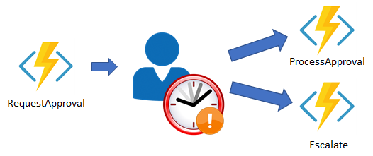

# Durable Functions

Durable Functions is an extension of Azure Functions. Whereas Azure Functions operate in a stateless environment, Durable Functions can retain state between function calls.

- They enable you to write event driven code. A durable function can wait asynchronously for one or more external events, and then perform a series of tasks in response to these events.
- You can chain functions together. You can implement common patterns such as fan-out/fan-in, which uses one function to invoke others in parallel, and then accumulate the results.
- You can orchestrate and coordinate functions, and specify the order in which functions should execute.
- The state is managed for you. You don't have to write your own code to save state information for a long-running function.

Durable functions allows you to define stateful workflows using an orchestration function.

- You can define the workflows in code. You don't need to write a JSON description or use a workflow design tool.
- Functions can be called both synchronously and asynchronously. Output from the called functions is saved locally in variables and used in subsequent function calls.
- Azure checkpoints the progress of a function automatically when the function awaits. Azure may choose to dehydrate the function and save its state while the function waits, to preserve resources and reduce costs. When the function starts running again, Azure will rehydrate it and restore its state.

Escalation steps are useful to the business, as they move along a task when a deadline has been reached. They ensure tasks are completed, and not forgotten. An escalation step could involve sending out reminders or even reassigning a task to someone higher up the managerial hierarchy.

## Function Types

You can use three durable function types: Client, Orchestrator, and Activity.

- **Client** functions are the entry point for creating an instance of a Durable Functions orchestration. They can run in response to an event from many sources, such as a new HTTP request arriving, a message being posted to a message queue, an event arriving in an event stream.
- **Orchestrator** functions describe how actions are executed, and the order in which they are run. You write the orchestration logic in code.
- **Activity** functions are the basic units of work in a durable function orchestration. An activity function contains the actual work performed by the tasks being orchestrated.

### Application Patterns

- **Function chaining**: In this pattern, the workflow executes a sequence of functions in a specified order. The output of one function is applied to the input of the next function in the sequence. The output of the final function is used to generate a result.

- **Fan out/fan in**: This pattern runs multiple functions in parallel and then waits for all the functions to finish. The results of the parallel executions can be aggregated or used to compute a final result.

- **Async HTTP APIs**: This pattern addresses the problem of coordinating state of long-running operations with external clients. An HTTP call can trigger the long-running action. Then, it can redirect the client to a status endpoint. The client can learn when the operation is finished by polling this endpoint.

- **Monitor**: This pattern implements a recurring process in a workflow, possibly looking for a change in state. For example, you could use this pattern to poll until specific conditions are met.

- **Human interaction**: This pattern combines automated processes that also involve some human interaction. A manual process within an automated process is tricky because people aren't as highly available and as responsive as most computers. Human interaction can be incorporated using timeouts and compensation logic that runs if the human fails to interact correctly within a specified response time. An approval process is an example of a process that involves human interaction.

## Azure Durable Functions vs Azure Logic Apps

| | Azure Durable Functions | Azure Logic Apps |
| --------- | --------- | --------- |
| Development | Code-first (imperative) | Design-first (declarative) |
| Connectivity | About a dozen built-in binding types. You can write code for custom bindings.  | Large collection of connectors. Enterprise Integration Pack for B2B. You can also build custom connectors. |
| Actions | Each activity is an Azure Function. You write the code for activity functions. | Large collection of ready-made actions. You integrate custom logic through custom connectors. |
| Monitoring | Azure Application Insights | Azure portal, Azure Monitor logs |
| Management | REST API, Visual Studio | Azure portal, REST API, PowerShell, Visual Studio |
| Execution context | Can run locally or in the cloud | Runs only in the cloud |